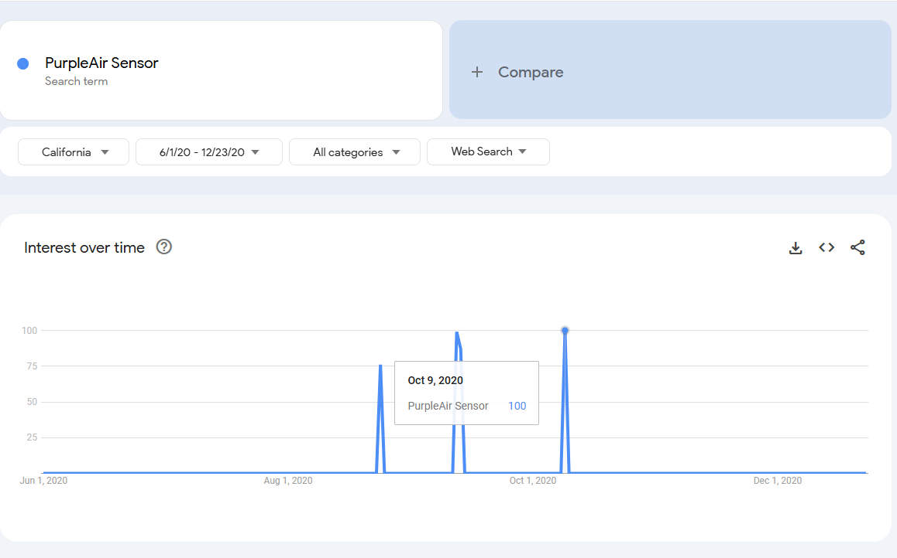

# Oakland PurpleAir Sensor Analysis

Analysis of PurpleAir sensors in Oakland, California, focusing on demographic Census Data, using Python, Pandas, GeoPandas, and DuckDB.

# Overview

This project leverages data from PurpleAir sensors in Oakland and U.S. Census data to explore patterns of sensor installations across census geographic tracts. The hope is to provide insights into how these environmental monitoring resources are distributed and identify potential disparities in air quality awareness across different communities in Oakland.

# Background
## The City of Oakland, California
[Oakland](https://www.oaklandca.gov/) is a diverse and vibrant city located in the San Francisco Bay Area, known for its cultural diversity, history of social justice movements, and significant economic disparities. As a major port city, it has a mix of residential neighborhoods, commercial districts, and industrial zones. The city faces numerous environmental challenges, including air quality issues, which may disproportionately affect lower-income communities. 

## PurpleAir Sensors
[PurpleAir](https://www2.purpleair.com/) sensors are low-cost, real-time, air quality monitoring devices designed to provide real-time data on [particulate matter (PM2.5)](https://phys.org/news/2021-03-air-pollution-silent-killer-pm25.html) levels in the air. These sensors are typically deployed in residential, commercial, and public spaces to track air pollution, making them a valuable tool for understanding air quality at a granular level, with collected data accessible through public platforms. Widespread adoption of these sensors has created new opportunities for community-driven environmental monitoring, allowing for greater transparency and awareness of localized pollution events.

# Data Structure Overview

The project utilizes two primary data sources:

* [PurpleAir Sensor Data](https://api.purpleair.com/#api-sensors-get-sensor-history) – This includes data on sensor installations, their geographic locations (latitude and longitude), and installation dates.
* U.S. Census Data 
|in Oakland California.
    * [Cartographic Boundary Shapefiles](https://www.census.gov/geographies/mapping-files/2018/geo/carto-boundary-file.html)    

We processed the following census tables:

* **B02001** – [Race](https://data.census.gov/table/ACSDT5Y2022.B02001) 
* **S1501** – [Educational Attainment](https://data.census.gov/table/ACSST1Y2022.S1501)
* **S1901** –  [Income in the Past 12 Months (In Inflation-Adjusted Dollars)](https://data.census.gov/table/ACSST1Y2022.S1901)
* **B15001** – [Sex by Age by Educational Attainment for the Population 18 Years and Over](https://data.census.gov/table/ACSST1Y2021.B15001) 

The U.S. Census Data used in this analysis is derived from the [American Community Survey (ACS)](https://www.census.gov/programs-surveys/acs/), an ongoing survey conducted by the U.S. Census Bureau. The ACS provides detailed and comprehensive demographic, social, economic, and housing information at the local level. 

We merged Census data from multiple years and tables, aligning demographic information like income, educational attainment, and race with PurpleAir sensor data. Using [Python](https://www.python.org/), [Pandas](https://pandas.pydata.org/), [GeoPandas](https://geopandas.org/en/stable/getting_started/introduction.html), and [DuckDB](https://duckdb.org/), we combined this data with geographic shape files to map Census Tracts and associate PurpleAir sensors with their respective locations. This enabled creation of [choropleth](https://en.wikipedia.org/wiki/Choropleth_map) maps that visualize the distribution of sensors and demographic trends across Oakland, using GeoPandas and [Plotly](https://plotly.com/python/). 

# Executive Summary

Our analysis of PurpleAir sensor installations across Oakland, California, revealed several patterns and trends in relation to demographic data. 

* **Income and Sensor Installs**: There is a mild positive correlation between median household income and sensor installations, especially in Northern Oakland. Over the period from 2018 to 2022, census tracts with higher median household incomes saw slightly more sensors installed. However, the relationship is not dominant, as many lower-income areas also received sensor coverage.

* **Racial Distribution**:  While sensor installations don’t correlate strongly with racial demographics, tracts with predominantly "White Alone," "Asian Alone" and "Two or More Races" populations tend to have a higher concentration of sensors. Conversely, the data suggests an overall lack of racial equity in sensor distribution across Oakland.

* **2020 Installation Spike**: The number of yearly sensor installations surged dramatically in 2020, rising from 17 in 2019 to 102 in 2020 (600%). This spike coincides with significant events like the COVID-19 pandemic and the wildfire season, though the specific cause of the increase remains uncertain. The sharp increase in sensors was not sustained in subsequent years, with installation rates dropping significantly in 2021 and 2022.

* **Education and Sensor Installs**: Tracts with 10-20% of the population aged 18-24 having degrees, and tracts where 30-40% of the 25+ population had degrees, saw the highest sensor counts. For populations aged 18-24 no positive correlation with sensor counts is observed until 2021, whereas 25+ populations had mildly positive correlation starting in 2019.

* **Geographic Disparities**: Southern Oakland, particularly the areas from the south to the southwestern borders, remains underrepresented in sensor installations. Northern Oakland continues to see higher sensor counts. This raises concerns about whether certain communities have adequate air quality monitoring.

# Insights Deep Dive
## Income Correlation

| Census Column Name | Correlation Value | Year |
| ------------------ | ----------------- | ---- |
| Estimate Married Couple Families Total| 0.66|	2020|
| Estimate Non-Family Households Total Income $200K or More |	0.61|2020|
| Estimate Families Total |	0.6| 2020|
| Estimate Households Total Income $200K or More|	0.6|	2020|
| Estimate Non-Family Households Median Income USD | 0.56|	2020|
**Table:** Census Columns with Highest Correlation to Sensor Count

Across all years, we observed mild positive correlation (between 0.4 to 0.6) between household median income and sensor installation across census tracts. This trend was consistent across most years, indicating that areas with higher median incomes tend to have more sensor installations.

* **Why this matters**: The relationship between income and sensor distribution highlights that wealthier areas have better air quality monitoring coverage. This raises questions about access to environmental data in lower-income communities.
* **Noteworthy Observations**:
Correlation values between income and sensor count are generally lower end of the spectrum, indicating that while income plays a role, it’s not the dominant factor in sensor placement. In spite of some of the stronger correlations observed, the plot above demonstrates installs are often done in single digits per tract. This makes it difficult to gauge the strength of association of income and sensor count.

## Racial Demographic Correlations

The year of 2020, and its spike in sensor installations, yields interesting aspects to explore regarding the pairplots relating to sensor counts:
* **White Alone**: The large number of single sensor installs suggest tracts with this population are receiving basic sensor coverage. The general upward trend of sensor counts and higher **White Alone** populations suggest this particular group might be associated with higher sensor counts, but this seems far from clear. The **White Alone** category appears positively correlated with **Asian Alone** and **Two or More Races** categories.
* **Black Alone**: Their population size does not consistently predict sensor distribution. With numerous tracts having low sensor counts regardless of **Black Alone** population size, this would indicate factors other the size of this population are driving sensor installation. The "spire" of tracts that resides near the y-axis indicates some tracts with low **Black Alone** populations are receiving disproportionate coverage.
* **Asian Alone**: Mirrors **White Alone** generally, but we observe less tracts with higher **Asian Alone** populations corresponding to higher sensor counts. Also appears to be positively correlated to sensor counts.
* **Native Alone and Pacific Islander Alone**: Both of their respective plots indicate that these populations are small in number or have low representation in tracts where sensors are installed. The amount of tracts with sensor coverage appears uniform regardless of the size of these two populations.
* **Two or More Races**: Shows moderate positive correlation, especially in the 250 to 500 population range. The **Two or More Races** category appears to positively correlate with **Total Population** and **White Alone** populations. There may be correlation with **Asian Alone** and **Black Alone** categories, but the spread of census tracts may not be simple to glean directly.

After 2020, sensor install counts contracted to levels nearing 2019 volume, and in 2022, a significant reduction in sensor installs occured. Clustering of tracts near the vertices of the scatterplots within the pairplot indicate low volumes of sensor installation happening in tracts with lower population areas.

### Racial Percentages in Census Tracts

Drilling into the top 10 tracts with the highest count of sensors indicates that certain populations are overrepresented versus the average racial categorizations for _all_ tracts that contain PurpleAir sensors.

|Census Tract|Total Population|	White |	Black |	American Indian and Alaskan|Asian|Pacific Islander or Hawaiian|Two Or More Races|	Other| Sensors|
|------------|----------------|-------|-------|-----------------------|-----|-----|-----|-----|----|
|4001|3115.00|68.12|4.11|	0.00	|19.23|	0.00|	5.36|	3.18|	14|
|4045.02|6070.00|75.14|	2.87 |0.18|13.06|0.00|8.45|	0.30|13|
|4046|4688.00|71.27|4.71|0.13|15.08|2.22|4.82|1.77|13|
|4044|5475.00|73.22|1.81|0.60|15.69|0.00|8.68|0.00|11|
|4081|6108.00|42.83|22.84|0.00|20.29|0.00|9.50|4.55|8|
|4043|3437.00|66.34|2.76|0.00|13.44|0.00|13.15|4.30|8|
|4261|6404.00| 76.61|1.28|0.25|17.55|	0.00|4.31|	0.00|8|
|4262|4904.00|72.37|2.67|0.08|16.13|0.14|8.42|0.18|6|
|4099|3680.00|27.97|47.99|0.35|6.17|0.00|14.70|2.83|6.0|
|4042|3849.00|66.85|6.34|0.26|17.49|0.96|6.26|1.85|5.0|

**Table:** Average Racial Percentages for Tracts with Highest Sensor Count

## Educational Attainment:
Educational attainment presented more nuanced patterns. Generally, sensor installations appear in areas where the population of people aged 18-24 with a Bachelor's degree was between 10-20%, and those aged 25 and above with a Bachelor's degree were in the 30-40% range. This may speak to a particular combination of age and educational attainment that may lead to consumers in these tracts installing PurpleAir sensors.

### 18 to 24 Years Bachelors Degree or Higher

### 25+ Years Bachelors Degree or Higher

* **2020 as an outlier**: In this year, the 18-24 and 25+ Bachelor's degree populations seemed to converge in terms of their percentage representation within census tracts with high sensor installations. This alignment between younger and older degree-holders is unusual and was not observed in other years.
* **Patterns in other years**: In non-spike years, census tracts with high sensor installations tended to have 25+ degree holders in the 30-40% range, and the 18-24 group was generally lower, in the 10-20% range.

## Geographic Coverage

The more affluent northern areas of Oakland had significantly more sensor installations compared to the southern regions.

Northern Oakland and central areas near and including Piedmont have more sensor coverage, while the southern tracts, particularly along the southern-most borders, have significant gaps.

Generally, year over year, new sensor installs appeared in census tracts with significant **Asian Alone**, **White Alone**, and **Two or More Races** racial categories. **White Alone** populations appear primarily in Northern Census tracts, with **Asian Alone** located centrally and **Two or More Races** being more evenly distributed across Oakland.

## 2020 Sensor Installation Spike

**Plot**: Number of Sensors Installed per Year

Despite this increase in sensor installations in 2020, sensor installations were not sustained and returned to pre-2020 levels in subsequent years, which may indicate temporary external drivers behind the spike.

It is unclear if the spike in installations in this year was "organic" in nature, a consequence of dedicated PurpleAir sales and marketing efforts, or resulted from public health and community awareness campaigns centered around Air Quality. We have conjectured this may be resultant from persistent wildfire activity, as well as the COVID-19 pandemic raising generalized health awareness and air quality concerns, culminating in consumers entering a sales funnel for these sensors.  

Consulting [Google Trends](https://trends.google.com/trends?geo=US&hl=en-US), we do observe distinct rise in search queries for "PurpleAir Sensor" in August 2020 through September 2020, reaching over 100 queries in a very short time period:

Filtering for the Bay Area, we see this even more clearly:

# Recommendations

## Public Health
* **Prioritize sensor installations in underserved areas**: The southern tracts of Oakland, which are predominantly lower-income and racially diverse, have significantly fewer sensors. To ensure equitable access to air quality data, it would be beneficial to prioritize installations in these areas.
* **Leverage educational institutions**: Since we observed higher sensor counts in areas with higher educational attainment, public health officials could partner with local schools and universities to raise awareness and encourage sensor installations in lower-education areas.
* **Respond to environmental crises with rapid deployment**: The sensor spike in 2020 suggests that external factors like wildfires and the pandemic motivated installations. Public health agencies could develop a rapid deployment strategy for future environmental crises to ensure swift and widespread sensor coverage.

## Marketing and Sales
* **Target campaigns toward lower-income and racially diverse communities**: There is clear room to grow sensor installations in areas with lower income and racially diverse populations. PurpleAir could develop targeted marketing campaigns that emphasize the health benefits of air quality monitoring in these underserved areas.
* **Capitalize on crisis-related demand**: The 2020 spike in sensor installations demonstrates that demand increases during environmental crises. PurpleAir could develop a crisis-response marketing strategy that ramps up during wildfire season or public health emergencies, offering promotions or incentives for purchasing sensors.
* **Highlight the educational benefits of sensors**: Given the correlation between educational attainment and sensor installations, PurpleAir could position their product as a tool for learning and awareness in schools and educational programs, potentially partnering with local governments or school districts to promote sensor adoption.

## Environmental Justice and Advocacy
* **Push for equitable distribution of sensors**: Advocacy groups should use the data to lobby for more sensor installations in lower-income and racially diverse tracts, particularly in the southern areas of Oakland that are currently underserved.
* **Raise awareness about air quality disparities**: The data shows that wealthier, whiter areas are better covered by air quality sensors. Advocacy groups could use this information to educate the public and push for policy changes that ensure more equitable distribution of environmental monitoring tools.
* **Collaborate with local governments to fund installations**: Social justice and environmental groups could partner with local government entities to secure funding for sensor installations in disadvantaged communities, ensuring that all residents have access to air quality data.

# Repository Structure
* `data/`: Contains the original CSV files and associated database files used in the analysis.
* `notebooks/`: Jupyter or Quarto notebooks documenting the analysis process.
* `reports/`: Generated reports, including the Final Report and 
Summary.
* `notebooks/Sortitoutsi_Keyword_Research.qmd`: The main analysis document written in Quarto, detailing the entire keyword research process.
* `reports/Project_Overview_and_Insights.md`: Front-end document with generalized project information.
* `README.md`: This document.

